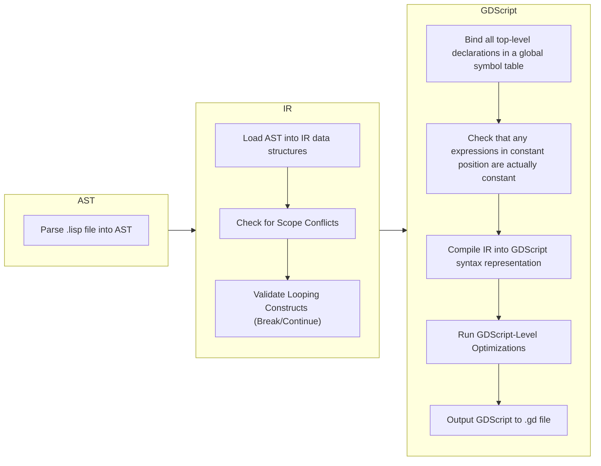

# Compilation Stages

This document details the stages of the GDLisp Compiler.

GDLisp source code begins in a `.lisp` source file. The parser loads
that into an abstract syntax tree (AST). At this point, the code is
*only* being viewed as a sequence of S-expressions that has no further
semantic meaning.

Next, the AST is loaded into a specially-designed intermediate
representation (IR). During loading into IR, any macros that are
encountered are evaluated and interpolated. Crucially, after the code
is loaded into its IR representation, no more macro expansion will
ever need to happen. The IR understands basic notions, such as the
difference between an expression and a declaration, as well as control
flow constructs like `cond` statements and assignment statements. It
does *not* understand more detailed scoping rules regarding local
variables.

Once the IR is loaded, some validation is performed on the code in its
IR form.
* All scopes are checked for name conflicts. While name shadowing is
  allowed (i.e. declaring a local function with the same name as a
  global one, or a local function with the same name as a local
  function in a strictly outer scope), declaring the same variable or
  function twice in the same scope is forbidden. Additionally, the
  top-level scope can declare at most one `main` class.
* Any loop control constructs are checked. That is, all uses of
  `break` and `continue` are audited to ensure that they make sense.
  `break` and `continue` can only be used inside of loops, and they
  cannot be used if there is a closure (such as a lambda) between the
  control construct and the loop declaration.

Next, the IR is analyzed, and a global symbol table is created. Any
top-level declarations have their names bound in the global symbol
table. This ensures that, during compilation, functions can access
functions declared anywhere in the file.

With the symbol table, any expressions in constant position are
checked to make sure they are actually constant. This includes `const`
declarations, the right-hand-side of `enum` values, and the inside of
`export` clauses.

Then the IR is compiled into an internal representation of GDScript.
This is basically GDScript source code, but represented as an abstract
syntax tree manipulable within the GDLisp engine. This compilation
takes into consideration the global symbol table and checks that any
referenced names (local or global) make sense in that context.

Once the GDScript source is built, some optimizations are performed on
it to eliminate dead code, simplify convoluted constructs, and
generally make the code better and faster. This step is specifically
disabled during unit and integration testing, except for those
specifically designed to test optimizations.

Finally, the resulting GDScript source is stringified and written out
to a `.gd` file.
